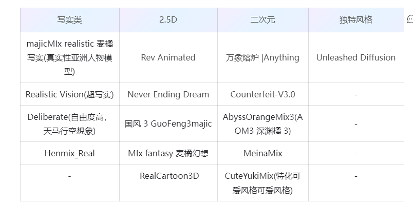

# -lora-
## 必须知道的常识
.checkpoint，.safetensors 的模型： SD模型  2g起步

lora模型：  一般不超过1g

微调方法：lora ，Dreambooth，textual inversion，超网络（textual inversion）

### 训练lora的目的
由于低秩适应，在模型某些层中引入低秩矩阵，实现高效微调，高效，训练快，低成本

缺点:相比于Dreambooth，textual inversion,不能精细的控制模型生成特定特征

### 训练lora的核心指标
易调用，泛化性，还原性

易调用：需要多少提示词完全生效

泛化性 ：能不能还原lora训练素材的特征，能不能和其他lora，模型，标签兼容

还原性：完全生效后的生成图片和训练素材之间的素材库

只需少量词高度还原训练素材中的任务-易调用和还原性

实现换装或保持服装的前提下将目标脸换掉-泛化性和还原性

过拟合：过于关注细节，忽略整体趋势

欠拟合：过于简单，缺少细节，无法表现更多细节和质感

## UI
1. WebUI

优点：界面友好，插件丰富，新手小白基本也能秒上手

缺点：吃显存，对配置要求较高，出图较慢

2. ComfyUI ：
优点：性能好，速度快，支持工作流的导入导出分享，对小显存友好（GPU小于3G以下依然可以工作），基于工作流，对出图逻辑理解更清晰

缺点：对新手用户不太友好，有一定学习成本

功能

1. 基础文生图
2. 基础图生图
3. 真人转动漫/动漫转真人
4. 线稿上色
5. 老旧照片修复
6. 隐藏艺术字
7. 改变人物姿态
8. 四维彩超宝宝长相预测
9. 红包封面
10. 真人电子AI写真定制
11. 赛博朋克风格转换
12. 专属表情包
13. 手机壁纸

## 模型社区
([Models - Hugging Face](https://huggingface.co/models)) 和 ([Civitai：开源生成式 AI 之家](https://civitai.com/))

画出真实人物的模型（去掉ai味）

flux模型

以及mj模型

去掉ai味道的lora

从以下方面考虑：

1. 僵硬的表情和姿势
2. 皮肤油腻和细节缺失
3. 光影镜头和摄影氛围

## 训练一个我的形象的美国队长

用户需求：

1. 我的脸具有美国队长的形象，身材不具体要求
2. 具有现实风格
这里我只是简单训练一个具有我的形象的美国队长，对于姿态和动作，并没有着重，如果需要可以在单独训练一个姿态lora

### 选择底模
本次训练的lora时真人风格的lora，所以选择一个泛化性好的真人底模，选择了majicmixRealistic_v7这个底模
触发词（尽量最大概率降低与提示词重复的概率）

### 数据集
我的形象

美国队长（这里可以实现定制化的美国队长）

这里我们希望生成一个美国队长概念化的图像，而不一定要精确复刻演员的面部（比如更侧重于服装、盾牌、姿势等）可以减少选择减少或模糊面部的细节。这样做可以使模型聚焦于美国队长的其他标志性特征，如他的战服、盾牌等。

由于sd1.5 对美国队长的生成并不好，训练美国队长的lora，增强美国队长的元素，对特征进一步细化！

满足个性化需求和细节要求

### 我的形象选择Deepdanbooru
添加了触发词
### 美队的形象选择deepdanbooru
因为底模可能具有美国队长的形象，但是画的并不符合我的感觉，所以在选取训练时，尽量与提示词冲突。
这里使用deepdanbooru给的提示词并不好，结合查找的，展示描述词
1boy, male_focus：专注于男性的外形特征
muscular build：角色的体型（强壮、肌肉发达），典型的肌肉型超级英雄。
superhero outfit， star emblem， shield，gloves：穿上美国队长的经典服装，并带有标志性的星形徽章和盾牌，手套
heroic, brave, battle-ready, confident posture：注重英雄气质，确保角色看起来既英勇又充满自信
upper body, full-body pose, action stance：描述了角色的姿势和动态

## 实验测试
使用majicmixRealistic_v7+底模sd1.5训得我的形象的lora（fine tuning）

但是呢 用户比较倔，非不喜欢这样的美国队长的装扮（风格），于是呢？

## 训练一个美国队长的lora
### 使用基底模型sd1.5训练的美国队长lora和测试模型sd1.5

### 重新训练个人形象的lora（触发词）和美国队长（触发词）
触发词

hxh-》11

uscaption-》12

调整美美国队长数据集（重点是服装、装备、体型和英雄气概）之前描述了，但是不够重点描述，

如：star emblem-》胸前的星徽

## 实验
先测试下画的美国队长

### 训练模型用sd1.5 测试模型用调整过的模型，原因？
1. 通用和稳定，避免过拟合和单一风格
2. 测试时使用 majicmixRealistic_v7 这样的专门化模型，可以针对某一特定风格或任务进行优化，提升图像生成的效果，尤其是在特定细节和风格的表现上。（结合majicmixRealistic_v7 在某些细节和风格上的优势，进一步提升效果）
3. 种训练与测试不同模型的策略，通常是为了最大化利用各个模型的优势，既保留了基础模型的通用性，又通过目标模型的定制化来增强特定任务的效果。

### 使用lora调整风格和微调已有模型

